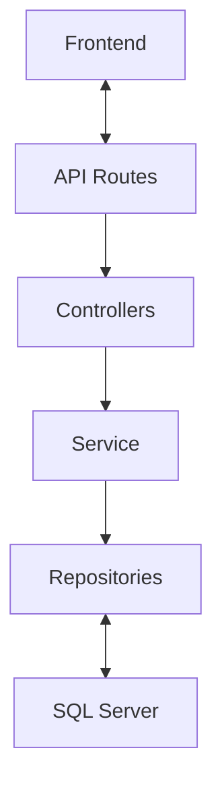

# Enterprise Order Management System (OMS)


-blue)


> Un sistema de gestión de pedidos robusto, transaccional y escalable. Diseñado con una arquitectura en capas estricta, garantiza la integridad de datos mediante transacciones ACID y ofrece una experiencia de usuario reactiva moderna.

---

## 📋 Tabla de Contenidos
1. [Arquitectura y Diseño](#-arquitectura-y-diseño)
2. [Características Principales](#-características-principales)
3. [Stack Tecnológico](#-stack-tecnológico)
4. [Instalación y Despliegue](#-instalación-y-despliegue)
5. [Modelo de Base de Datos](#-modelo-de-base-de-datos)
6. [Pruebas](#-pruebas)

---

## 🏗 Arquitectura y Diseño

El sistema sigue una **Arquitectura en Capas (Layered Architecture)** para asegurar la separación de responsabilidades y la mantenibilidad.         


Estructura del proyecto
```text
order-management-system/
│
├── backend/                 # API REST (Node.js + Express)
│   ├── scripts/             # Scripts SQL (Init, Seeds, Stored Procedures)
│   ├── src/
│   │   ├── config/          # Configuración de BD y Constantes
│   │   ├── controllers/     # Capa de entrada HTTP (Request/Response)
│   │   ├── middleware/      # Validaciones, Auth y Error Handling global
│   │   ├── models/          # Definición de clases (Customer, Order, etc.)
│   │   ├── repositories/    # Capa de Acceso a Datos (Queries SQL directas)
│   │   ├── routes/          # Definición de rutas de la API
│   │   ├── services/        # Lógica de Negocio y Transacciones ACID
│   │   ├── utils/           # Loggers y funciones auxiliares
│   │   ├── app.js           # Configuración de Express
│   │   └── server.js        # Entry point del servidor
│   └── tests/               # Pruebas Unitarias (Jest)
│
├── frontend/                # SPA (React + Vite + Tailwind)
│   ├── public/
│   ├── src/
│   │   ├── api/             # Servicios de conexión con el Backend (Axios)
│   │   ├── components/      # Componentes UI reutilizables
│   │   │   ├── common/      # Modales, Spinners, Badges
│   │   │   ├── dashboard/   # Gráficos y Cards
│   │   │   ├── layout/      # Sidebar, Header
│   │   │   └── orders/      # Formularios y Listas complejos
│   │   ├── context/         # Estado Global (AppContext)
│   │   ├── hooks/           # Custom Hooks (useOrders, etc.)
│   │   ├── pages/           # Vistas principales (Routing)
│   │   └── App.jsx          # Componente Raíz
│   ├── index.html           # Punto de entrada de Vite
│   └── tailwind.config.js   # Configuración de estilos
│
├── docker-compose.yml       # Orquestación de SQL Server
└── README.md                # Documentación del proyecto
```

Decisiones Técnicas Clave:
- Transacciones ACID: La creación de órdenes y el descuento de stock ocurren dentro de una transacción atómica (BEGIN TRANSACTION... COMMIT/ROLLBACK). Si falla el stock, no se crea la orden.             

- Repository Pattern: Abstracción total del SQL. Los servicios no conocen la estructura de la base de datos, solo solicitan entidades.               

- Audit Trail: Sistema de StockMovements que registra cada entrada y salida de inventario con referencia cruzada (Trazabilidad completa).                

- Validación Robusta: Uso de express-validator en backend y validaciones reactivas en frontend.                 

Características Principales:                
 
- Ciclo de Vida de Órdenes: Creación, Confirmación, Envío, Entrega y Cancelación (con reversión automática de stock).                             

- Control de Inventario: Bloqueo de ventas sin stock y alertas visuales de "Low Stock".                                       

- Gestión de Clientes: Cartera completa de clientes.                          

Dashboard Ejecutivo:                             
- KPIs en Tiempo Real: Ingresos totales, Tickets promedio.                                         
 
- Visualización de Datos: Gráficos de distribución de órdenes y curvas de ingresos.                         

Ingeniería de Software:                     
- Seeders Inteligentes: Scripts SQL para poblar la BD con datos de prueba realistas.                       

- Manejo de Errores Centralizado: Middleware global para captura de excepciones.                

Stack Tecnológico

| Área | Tecnología | 
|------|------------|
| **Backend** | Node.js |        
| **Framework** | Express.js |                
| **DataBase** | SQL Server (MSSQL) |                  
| **Frontend** | React, Vite |                
| **Logging** | Winston |                 
| **Testing** | Jest |                    
| **Graficos* | Chart.js |                

Instalación y Despliegue
```text
Prerrequisitos
Node.js v18+

Docker & Docker Compose

1. Levantar Base de Datos
Bash

docker-compose up -d
Esto levantará un contenedor de SQL Server en el puerto 1433.

2. Inicializar Esquema y Datos
Conecta tu cliente SQL favorito (Azure Data Studio / SSMS) a localhost,1433 (User: sa, Pass: ver docker-compose.yml) y ejecuta los scripts en la carpeta backend/scripts/ en este orden estricto:

01_create_database.sql (Estructura)

02_seed_data.sql (Datos base)

03_stored_procedures.sql (Lógica programable)

04_populate_fake_data.sql (Generación masiva de 50 órdenes de prueba)

3. Configurar Backend
Bash

cd backend
npm install
# Crear archivo .env basado en .env.example
npm run dev
4. Configurar Frontend
Bash

cd frontend
npm install
npm run dev
Abra el navegador en http://localhost:5173.

🗄 Modelo de Base de Datos
El esquema relacional está diseñado en Tercera Forma Normal (3NF).

Customers: Información maestra de clientes.

Products: Catálogo con control de stock y concurrencia optimista (vía validación de stock al momento de transacción).

Orders: Cabecera de la orden (Estado, Total, Cliente).

OrderItems: Detalle línea a línea.

StockMovements: Tabla inmutable de auditoría (Log de movimientos IN/OUT).

✅ Pruebas
El backend incluye pruebas unitarias para la lógica crítica de negocio (Cálculo de totales y validación de stock).

Bash

cd backend
npm test
```

🗺 Roadmap & Mejoras Futuras
- Seguridad: Implementar JWT (JSON Web Tokens) y Roles (Admin/User).                     

- Reportes: Exportación de órdenes a PDF.                        

- Concurrencia: Implementar "Optimistic Locking" usando un campo Version en productos para prevenir condiciones de carrera en alto tráfico.                              

- CI/CD: Pipeline de GitHub Actions para testing automático.                       

Desarollado por Kevin Alajarin - 2025
